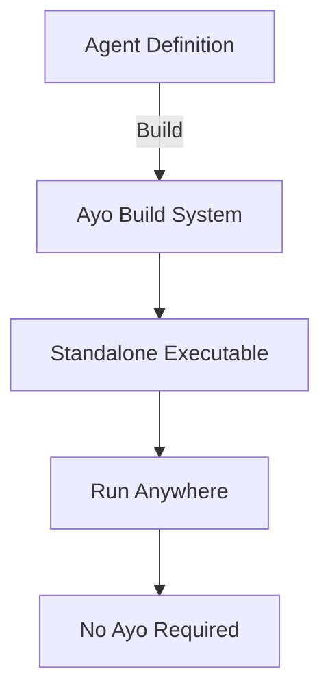
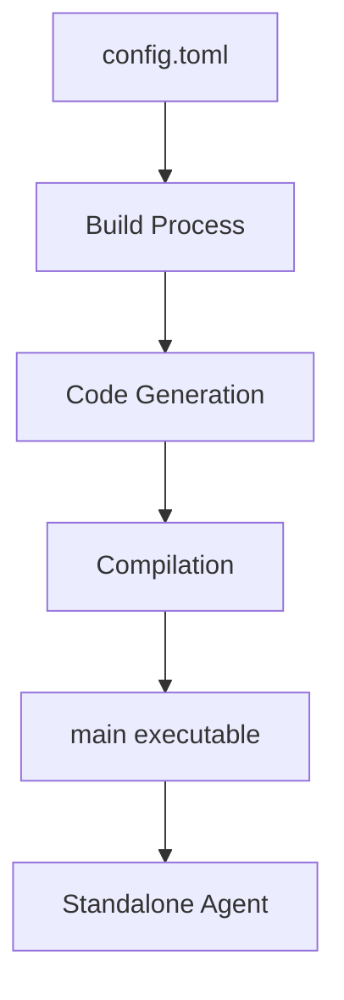

# Getting Started with Ayo

## Welcome to Ayo Build System

Ayo is a powerful build system for creating standalone AI agent executables. This guide will take you from complete beginner to confident user.

## What You'll Learn

- ✅ Understanding what Ayo does
- ✅ Installing Ayo on your system
- ✅ Creating your first AI agent
- ✅ Building and running agents
- ✅ Basic configuration concepts

## What is Ayo?

Ayo is **not** a runtime framework. It's a **build system** that compiles agent definitions into self-contained executables.

### Key Concepts

| Concept | Description |
|---------|-------------|
| **Agent Definition** | Your agent's configuration and logic |
| **Build Process** | Compiles definition into executable |
| **Standalone Executable** | Self-contained binary that runs anywhere |
| **No Runtime Dependencies** | Built agents don't need Ayo to run |

### Why This Matters



## Installation

### System Requirements

- **Operating System**: macOS, Linux, or Windows
- **Go Version**: 1.20+
- **Disk Space**: 500MB minimum
- **Memory**: 2GB minimum (4GB recommended)

### Installation Methods

#### Method 1: Homebrew (Recommended for macOS)

```bash
# Tap the Ayo repository
brew tap alexcabrera/ayo

# Install Ayo
brew install ayo

# Verify installation
ayo --version
# Output: ayo version 1.0.0
```

#### Method 2: Build from Source

```bash
# Clone the repository
git clone https://github.com/alexcabrera/ayo.git
cd ayo

# Build and install
make install

# Verify installation
ayo --version
```

#### Method 3: Manual Installation

```bash
# Download pre-built binary (check releases)
wget https://github.com/alexcabrera/ayo/releases/download/v1.0.0/ayo_1.0.0_darwin_amd64.tar.gz

# Extract and install
tar -xzvf ayo_1.0.0_darwin_amd64.tar.gz
sudo mv ayo /usr/local/bin/

# Verify
ayo --version
```

### Troubleshooting Installation

**Problem**: `ayo: command not found`

**Solution**:
```bash
# Check if binary exists
ls /usr/local/bin/ayo

# Add to PATH if needed
export PATH=$PATH:/usr/local/bin

# Or reinstall
brew reinstall ayo
```

**Problem**: Permission denied

**Solution**:
```bash
chmod +x /usr/local/bin/ayo
```

## Your First Agent

### Step 1: Create a New Agent

```bash
# Create a new agent project
ayo fresh my-first-agent

# This creates:
# my-first-agent/
#   ├── config.toml      # Main configuration
#   ├── prompts/         # Prompt templates
#   ├── skills/          # Agent skills
#   ├── tools/           # Custom tools
#   └── main             # Built executable (after build)
```

### Step 2: Explore the Structure

```bash
cd my-first-agent
ls -la

# You'll see:
# - config.toml: Main configuration file
# - prompts/: Directory for prompt templates
# - skills/: Directory for agent skills
# - tools/: Directory for custom tools
```

### Step 3: Understand the Configuration

Open `config.toml` in your favorite editor:

```toml
# Basic agent configuration
[agent]
name = "my-first-agent"      # Agent name
description = "My first AI agent"  # Agent description
model = "gpt-4o"            # LLM model to use

# CLI configuration
[cli]
mode = "interactive"        # CLI mode
description = "My first CLI agent"  # CLI description

# Input schema (JSON Schema)
[input]
schema = { 
  type = "object", 
  properties = { 
    query = { type = "string" } 
  } 
}

# Output schema (JSON Schema)
[output]
schema = { 
  type = "object", 
  properties = { 
    result = { type = "string" } 
  } 
}

# Tools configuration
[agent.tools]
allowed = ["bash", "file_read", "file_write"]

# Memory configuration
[agent.memory]
enabled = true
scope = "conversation"
```

### Step 4: Build Your Agent

```bash
# Build the agent
ayo build my-first-agent

# You'll see:
# Successfully built: /path/to/my-first-agent
```

### Step 5: Run Your Agent

```bash
# Run the agent
./my-first-agent/main "Hello, world!"

# Expected output:
# Agent: my-first-agent
# Description: My first AI agent
# Config size: 379 bytes
```

## Understanding What Just Happened

### The Build Process



### Key Files Explained

| File | Purpose |
|------|---------|
| `config.toml` | Defines your agent's behavior |
| `prompts/` | Contains prompt templates |
| `skills/` | Contains agent skills |
| `tools/` | Contains custom tools |
| `main` | The built executable |

## Basic Configuration Concepts

### Agent Configuration

```toml
[agent]
name = "string"           # Your agent's name
description = "string"    # Description of what it does
model = "string"          # LLM model (gpt-4o, claude-3-opus, etc.)
temperature = 0.7          # Creativity level (0.0-1.0)
max_tokens = 4096          # Maximum response length
```

### CLI Configuration

```toml
[cli]
mode = "interactive"      # How the agent interacts
description = "string"    # CLI description

[cli.flags]
# Define command-line flags
verbose = { 
  type = "bool", 
  description = "Enable verbose output" 
}
```

### Input/Output Schemas

```toml
[input]
# Define what input your agent accepts
schema = '''
{
  "type": "object",
  "properties": {
    "query": { "type": "string" },
    "context": { "type": "string" }
  },
  "required": ["query"]
}
'''

[output]
# Define what output your agent produces
schema = '''
{
  "type": "object",
  "properties": {
    "result": { "type": "string" },
    "confidence": { "type": "number" }
  },
  "required": ["result"]
}
'''
```

## Common Commands Cheat Sheet

| Command | Description |
|---------|-------------|
| `ayo fresh <name>` | Create new agent |
| `ayo build <dir>` | Build agent |
| `ayo checkit <dir>` | Validate configuration |
| `ayo --version` | Show version |
| `ayo --help` | Show help |

## Next Steps

Now that you've created your first agent, you're ready to:

1. 📖 **Learn basic usage** → [Basic Usage Guide](02-basic-usage.md)
2. 🛠 **Customize your agent** → Modify `config.toml`
3. 🔧 **Add tools** → Explore the `tools/` directory
4. 📝 **Create skills** → Add files to `skills/` directory

## Frequently Asked Questions

**Q: Do I need to know Go to use Ayo?**

A: No! Ayo handles all the Go code generation for you. You only need to define your agent's behavior.

**Q: Can I distribute the built agents?**

A: Yes! The `main` executable is completely standalone and can run on any compatible system.

**Q: What LLM models are supported?**

A: Any model supported by the Fantasy framework (GPT-4, Claude, Gemini, Llama, etc.)

**Q: How do I update my agent?**

A: Just edit the configuration and rebuild:
```bash
ao build my-agent
```

## Troubleshooting Your First Agent

**Problem**: Build fails

**Solution**:
```bash
# Check your configuration
ao checkit my-agent

# Look for error messages and fix them
```

**Problem**: Agent doesn't respond as expected

**Solution**:
```bash
# Check your input/output schemas
# Make sure they match what you're trying to do
```

**Problem**: Permission denied when running

**Solution**:
```bash
chmod +x my-agent/main
```

## Summary

✅ **Installed Ayo**
✅ **Created your first agent**
✅ **Built and ran it successfully**
✅ **Understood the basic concepts**

You're now ready to explore more advanced features! 🎉

**Next**: [Basic Usage Guide](02-basic-usage.md) → Learn how to customize and extend your agents