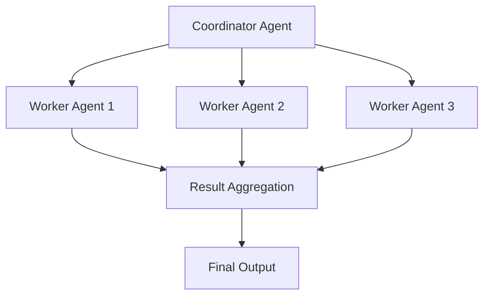

# Advanced Patterns

## Mastering Complex Agent Systems

Welcome to advanced Ayo patterns. This guide covers sophisticated techniques for building production-grade agent systems.

## Table of Contents

1. [Multi-Agent Orchestration](#multi-agent-orchestration)
2. [Complex Workflow Patterns](#complex-workflow-patterns)
3. [Production Deployment](#production-deployment)
4. [Monitoring and Observability](#monitoring-and-observability)
5. [Security and Compliance](#security-and-compliance)
6. [Scaling Strategies](#scaling-strategies)
7. [Advanced Integration Patterns](#advanced-integration-patterns)

## Multi-Agent Orchestration

### Agent Team Architecture



### Team Configuration

```bash
# Create team coordinator
ayo fresh team-coordinator

# Edit config.toml
[agent]
name = "team-coordinator"
description = "Multi-agent orchestration"
model = "gpt-4o"

[agent.team]
workers = ["worker1", "worker2", "worker3"]
strategy = "round_robin"  # round_robin, priority, or adaptive

[agent.communication]
protocol = "json"  # json, protobuf, or custom
timeout = 30
retry_limit = 3

[agent.coordination]
result_aggregation = "consensus"  # consensus, majority, or weighted
conflict_resolution = "vote"      # vote, seniority, or manual
```

### Worker Agent Configuration

```toml
# worker-config.toml
[agent]
name = "worker1"
description = "Specialized worker agent"
model = "gpt-4o"
role = "data_analyst"

[agent.capabilities]
data_analysis = true
report_generation = true
visualization = false

[agent.communication]
coordinator_address = "team-coordinator:8080"
polling_interval = 5
heartbeat_timeout = 30
```

### Multi-Agent Workflow

```toml
[agent.team.workflow]
phases = [
  {
    name = "data_collection",
    agents = ["worker1", "worker2"],
    parallel = true,
    timeout = 60
  },
  {
    name = "analysis",
    agents = ["worker3"],
    parallel = false,
    depends_on = ["data_collection"],
    timeout = 120
  },
  {
    name = "reporting",
    agents = ["worker1", "worker2", "worker3"],
    parallel = true,
    depends_on = ["analysis"],
    timeout = 90
  }
]
```

## Complex Workflow Patterns

### Conditional Workflows

```toml
[agent.workflow.conditions]
high_priority = '''
{{if gt .Input.priority 5}}
  ["fast_track_processing", "executive_review"]
{{else}}
  ["standard_processing", "team_review"]
{{end}}
'''

complex_analysis = '''
{{if or (eq .Input.analysis_type "advanced") (gt .Input.data_size 10000)}}
  ["data_sampling", "advanced_analysis", "quality_check"]
{{else}}
  ["basic_analysis", "quick_review"]
{{end}}
'''
```

### Dynamic Routing

```toml
[agent.routing]
rules = [
  {
    condition = "{{.Input.request_type}} == 'urgent'",
    destination = "priority_queue",
    priority = 10
  },
  {
    condition = "{{.Input.customer_tier}} == 'premium'",
    destination = "vip_team",
    priority = 8
  },
  {
    condition = "{{.Input.data_size}} > 1000",
    destination = "large_data_team",
    priority = 5
  },
  {
    condition = "default",
    destination = "standard_queue",
    priority = 3
  }
]
```

### State Machines

```toml
[agent.state_machine]
initial_state = "ready"
states = {
  ready = {
    transitions = {
      receive_task = "processing",
      heartbeat = "ready"
    }
  },
  processing = {
    transitions = {
      complete = "review",
      fail = "error_handling",
      timeout = "ready"
    },
    timeout = 300
  },
  review = {
    transitions = {
      approve = "complete",
      reject = "processing",
      escalate = "escalated"
    }
  },
  error_handling = {
    transitions = {
      retry = "processing",
      give_up = "ready",
      escalate = "escalated"
    },
    max_retries = 3
  }
}
```

## Production Deployment

### Deployment Strategies

```toml
[agent.deployment]
strategy = "rolling"  # rolling, blue_green, or canary
rollout_percentage = 20
health_check = "/health"
readiness_check = "/ready"

[agent.deployment.rolling]
batch_size = 2
batch_interval = 30
max_unavailable = 1

[agent.deployment.blue_green]
old_version = "v1.0.0"
new_version = "v2.0.0"
traffic_split = 0.1  # 10% to new version

[agent.deployment.canary]
canary_percentage = 5
duration = 3600  # 1 hour
promotion_criteria = "error_rate < 0.01"
```

### Containerization

```dockerfile
# Dockerfile for Ayo agent
FROM alpine:latest

# Install dependencies
RUN apk add --no-cache bash curl jq python3 py3-pip

# Copy agent files
COPY . /app
WORKDIR /app

# Set permissions
RUN chmod +x main
RUN find tools/ -type f -exec chmod +x {} \;

# Health check
HEALTHCHECK --interval=30s --timeout=3s \
  CMD ./main --health-check || exit 1

# Run agent
CMD ["./main"]
```

### Kubernetes Deployment

```yaml
# deployment.yaml
apiVersion: apps/v1
kind: Deployment
metadata:
  name: ayo-agent
  labels:
    app: ayo-agent
spec:
  replicas: 3
  selector:
    matchLabels:
      app: ayo-agent
  template:
    metadata:
      labels:
        app: ayo-agent
    spec:
      containers:
      - name: ayo-agent
        image: my-ayo-agent:latest
        ports:
        - containerPort: 8080
        resources:
          requests:
            cpu: "500m"
            memory: "512Mi"
          limits:
            cpu: "1000m"
            memory: "1Gi"
        livenessProbe:
          httpGet:
            path: /health
            port: 8080
          initialDelaySeconds: 30
          periodSeconds: 10
        readinessProbe:
          httpGet:
            path: /ready
            port: 8080
          initialDelaySeconds: 5
          periodSeconds: 5
      restartPolicy: Always
```

## Monitoring and Observability

### Metrics Configuration

```toml
[agent.monitoring.metrics]
enabled = true
port = 9090
path = "/metrics"

[agent.monitoring.metrics.types]
request_count = true
request_latency = true
error_rate = true
token_usage = true
tool_execution_time = true
memory_usage = true

[agent.monitoring.metrics.labels]
agent_name = "{{.Agent.Name}}"
agent_version = "{{.Agent.Version}}"
environment = "{{.Environment}}"
```

### Logging Configuration

```toml
[agent.logging]
level = "info"  # debug, info, warn, error
format = "json"  # json, text, or structured
output = ["stdout", "file"]

[agent.logging.file]
path = "./logs/agent.log"
max_size = 100  # MB
max_backups = 7
max_age = 30    # days
compress = true

[agent.logging.filter]
include = ["error", "warn", "request", "response"]
exclude = ["debug", "internal"]

[agent.logging.sampling]
enabled = true
debug_rate = 0.1  # 10% of debug logs
info_rate = 0.5   # 50% of info logs
```

### Tracing Configuration

```toml
[agent.tracing]
enabled = true
provider = "jaeger"  # jaeger, zipkin, or otel
service_name = "ayo-agent"
environment = "production"

[agent.tracing.sampling]
type = "probabilistic"
rate = 0.1

[agent.tracing.tags]
agent.name = "{{.Agent.Name}}"
agent.version = "{{.Agent.Version}}"
request.id = "{{.Request.ID}}"

[agent.tracing.baggage]
enabled = true
fields = ["user_id", "session_id", "request_id"]
```

## Security and Compliance

### Security Configuration

```toml
[agent.security]
authentication = "jwt"  # jwt, api_key, or none
authorization = "rbac"  # rbac, abac, or none
encryption = "aes-256"   # aes-256, aes-128, or none

[agent.security.jwt]
secret = "${JWT_SECRET}"
expiration = 3600  # 1 hour
issuer = "ayo-agent"
algorithms = ["HS256"]

[agent.security.rbac]
roles = ["admin", "user", "guest"]
policies = {
  admin = ["*"],
  user = ["read", "execute"],
  guest = ["read"]
}

[agent.security.api_keys]
enabled = true
header = "X-API-Key"
prefix = "ak_"
```

### Data Protection

```toml
[agent.security.data]
redaction = {
  enabled = true,
  patterns = [
    "\\b\\w*password\\w*\\b",
    "\\b\\w*secret\\w*\\b",
    "\\b\\w*token\\w*\\b",
    "\\b\\w*key\\w*\\b"
  ],
  replacement = "[REDACTED]"
}

encryption = {
  fields = ["password", "credit_card", "ssn"],
  algorithm = "aes-256-cbc",
  key_rotation = 30  # days
}

masking = {
  enabled = true,
  patterns = [
    { type = "email", mask = "**@**.com" },
    { type = "credit_card", mask = "****-****-****-1234" },
    { type = "phone", mask = "***-***-1234" }
  ]
}
```

### Compliance Configuration

```toml
[agent.compliance]
gdpr = {
  enabled = true,
  data_retention = 90,  # days
  right_to_be_forgotten = true,
  data_portability = true
}

hipaa = {
  enabled = false,
  audit_logs = true,
  access_controls = true,
  encryption = "required"
}

pci_dss = {
  enabled = false,
  tokenization = true,
  logging = "required",
  monitoring = "required"
}

[agent.compliance.audit]
enabled = true
log_retention = 365  # days
immutable_storage = true
audit_events = ["authentication", "authorization", "data_access", "configuration_change"]
```

## Scaling Strategies

### Horizontal Scaling

```toml
[agent.scaling.horizontal]
enabled = true
min_replicas = 2
max_replicas = 10

[agent.scaling.metrics]
cpu_target = 70  # percentage
memory_target = 80  # percentage
requests_per_second = 100

[agent.scaling.cooldown]
scale_down = 300  # seconds
scale_up = 60    # seconds

[agent.scaling.strategy]
type = "aggressive"  # conservative, balanced, or aggressive
scale_up_factor = 2
scale_down_factor = 0.5
```

### Vertical Scaling

```toml
[agent.scaling.vertical]
enabled = true
resource_profiles = {
  small = {
    cpu = "500m",
    memory = "512Mi",
    max_requests = 50
  },
  medium = {
    cpu = "1000m",
    memory = "1Gi",
    max_requests = 200
  },
  large = {
    cpu = "2000m",
    memory = "2Gi",
    max_requests = 500
  }
}

[agent.scaling.vertical.triggers]
cpu_threshold = 80
memory_threshold = 85
queue_length = 100
timeout_rate = 0.1
```

### Load Balancing

```toml
[agent.load_balancing]
strategy = "round_robin"  # round_robin, least_connections, or ip_hash
health_check_interval = 30
unhealthy_threshold = 3
healthy_threshold = 2

[agent.load_balancing.session]
persistence = true
timeout = 1800  # seconds
cookie_name = "ayo_session"

[agent.load_balancing.weighted]
workers = {
  worker1 = 0.4,
  worker2 = 0.3,
  worker3 = 0.3
}
```

## Advanced Integration Patterns

### API Gateway Integration

```toml
[agent.api_gateway]
enabled = true
base_path = "/api/v1/agents"
rate_limiting = {
  enabled = true,
  requests_per_minute = 100,
  burst_limit = 20
}

[agent.api_gateway.authentication]
type = "api_key"
header = "X-API-Key"
prefix = "ak_"

[agent.api_gateway.endpoints]
health = {
  path = "/health",
  method = "GET",
  auth_required = false
}
execute = {
  path = "/execute",
  method = "POST",
  auth_required = true
}
status = {
  path = "/status",
  method = "GET",
  auth_required = true
}
```

### Event-Driven Architecture

```toml
[agent.events]
enabled = true
provider = "kafka"  # kafka, rabbitmq, or sns

[agent.events.topics]
input = "agent-input"
output = "agent-output"
errors = "agent-errors"
logs = "agent-logs"

[agent.events.consumers]
input_group = "agent-consumer-group"
concurrency = 4

[agent.events.producers]
output_retries = 3
output_timeout = 5

[agent.events.schema]
input = "avro"
output = "json"
```

### Webhook Integration

```toml
[agent.webhooks]
enabled = true
secret = "${WEBHOOK_SECRET}"

[agent.webhooks.endpoints]
status_update = {
  url = "https://example.com/webhook/status",
  method = "POST",
  events = ["completed", "failed", "started"]
}

alert = {
  url = "https://example.com/webhook/alert",
  method = "POST",
  events = ["error", "timeout", "resource_limit"]
}

[agent.webhooks.retry]
max_attempts = 3
backoff = [1, 5, 15]  # seconds
timeout = 10

[agent.webhooks.security]
verify_ssl = true
ip_whitelist = ["192.168.1.0/24", "10.0.0.0/8"]
```

## Production Examples

### Example 1: Enterprise Document Processing

```bash
# Create enterprise document processor
ayo fresh enterprise-docs

# Edit config.toml
[agent]
name = "enterprise-docs"
description = "Enterprise document processing system"
model = "gpt-4o"

[agent.team]
workers = ["ocr-worker", "analysis-worker", "review-worker"]
strategy = "priority"

[agent.scaling]
horizontal = {
  enabled = true,
  min_replicas = 3,
  max_replicas = 15
}

[agent.monitoring]
metrics = { enabled = true, port = 9090 }
logging = { level = "info", format = "json" }
tracing = { enabled = true, provider = "jaeger" }

[agent.security]
authentication = "jwt"
authorization = "rbac"
encryption = "aes-256"

[agent.compliance]
gdpr = { enabled = true, data_retention = 90 }

# Build and deploy
ayo build enterprise-docs
docker build -t enterprise-docs .
kubectl apply -f deployment.yaml
```

### Example 2: Real-time Data Pipeline

```bash
# Create real-time pipeline
ayo fresh realtime-pipeline

# Edit config.toml
[agent]
name = "realtime-pipeline"
description = "Real-time data processing pipeline"
model = "gpt-4o"
temperature = 0.3

[agent.events]
enabled = true
provider = "kafka"
topics = {
  input = "raw-data",
  output = "processed-data",
  errors = "processing-errors"
}

[agent.streaming]
enabled = true
batch_size = 100
batch_timeout = 5  # seconds
max_concurrency = 8

[agent.error_handling]
max_retries = 2
retry_delay = 1
circuit_breaker = {
  failure_threshold = 5,
  recovery_timeout = 60
}

[agent.performance]
cache = { enabled = true, size = 1000, ttl = 300 }
parallel_execution = { enabled = true, max_concurrent = 16 }

# Build and deploy
ayo build realtime-pipeline
docker-compose up -d
```

### Example 3: Multi-Region Deployment

```bash
# Create multi-region agent
ayo fresh multi-region-agent

# Edit config.toml
[agent]
name = "multi-region-agent"
description = "Globally distributed agent"
model = "gpt-4o"

[agent.deployment]
regions = ["us-east-1", "us-west-2", "eu-west-1", "ap-southeast-1"]
strategy = "geo_routing"

[agent.load_balancing]
strategy = "geo_ip"
fallback_region = "us-east-1"

[agent.replication]
sync = {
  enabled = true,
  interval = 60,
  conflict_resolution = "last_write_wins"
}

async = {
  enabled = true,
  max_delay = 300,
  queue_size = 1000
}

[agent.failover]
primary = "us-east-1"
secondary = "us-west-2"
health_check_interval = 30
failover_threshold = 3

# Build region-specific versions
for region in us-east-1 us-west-2 eu-west-1 ap-southeast-1; do
  ayo build multi-region-agent --region $region
  docker build -t multi-region-agent:$region .
done

# Deploy to each region
# (Use your preferred deployment tool)
```

## Best Practices for Advanced Users

### Architecture

1. **Modular Design**: Separate concerns into different agents
2. **Clear Interfaces**: Well-defined APIs between components
3. **Failure Isolation**: Design for independent component failures
4. **Observability**: Comprehensive monitoring from day one

### Security

1. **Principle of Least Privilege**: Minimum necessary permissions
2. **Defense in Depth**: Multiple security layers
3. **Regular Audits**: Schedule security reviews
4. **Secret Management**: Use proper secret storage

### Performance

1. **Measure First**: Profile before optimizing
2. **Cache Strategically**: Cache at the right levels
3. **Parallelize**: Use concurrency where appropriate
4. **Resource Limits**: Set and enforce limits

### Deployment

1. **Phased Rollouts**: Gradual deployment to production
2. **Rollback Plan**: Always have a fallback
3. **Health Checks**: Comprehensive readiness checks
4. **Documentation**: Keep deployment docs updated

## Troubleshooting Advanced Issues

### Multi-Agent Problems

**Issue**: Agents not communicating

**Solution**:
```bash
# Check network connectivity
ayo diagnose team-coordinator --network

# Verify communication protocol
ayo checkit team-coordinator --communication

# Test individual agents
ayo test worker1 --isolated
ayo test worker2 --isolated
```

**Issue**: Workflow deadlocks

**Solution**:
```bash
# Analyze workflow
ayo analyze team-coordinator --workflow

# Check for circular dependencies
ayo validate team-coordinator --dependencies

# Enable debug logging
[agent.logging]
level = "debug"
```

### Production Problems

**Issue**: High latency in production

**Solution**:
```bash
# Check metrics
ayo metrics team-coordinator --latency

# Profile performance
ayo profile team-coordinator --duration 60

# Optimize configuration
[agent.performance]
cache = { size = 200, ttl = 600 }
parallel_execution = { max_concurrent = 8 }
```

**Issue**: Memory leaks

**Solution**:
```bash
# Monitor memory usage
ayo monitor team-coordinator --memory

# Set memory limits
[agent.resources]
memory_limit = "1Gi"
graceful_shutdown_timeout = 15

# Enable garbage collection
[agent.gc]
enabled = true
interval = 300
aggressiveness = 0.5
```

### Scaling Problems

**Issue**: Auto-scaling not working

**Solution**:
```bash
# Check scaling metrics
ayo metrics team-coordinator --scaling

# Adjust scaling configuration
[agent.scaling.horizontal]
min_replicas = 3
max_replicas = 15
cpu_target = 65

# Verify health checks
ayo health team-coordinator --detailed
```

**Issue**: Load balancing uneven

**Solution**:
```bash
# Check load distribution
ayo monitor team-coordinator --load-balancing

# Adjust load balancing
[agent.load_balancing]
strategy = "least_connections"
health_check_interval = 15

# Add more replicas
ayo scale team-coordinator --replicas 5
```

## Summary

✅ **Mastered multi-agent orchestration**
✅ **Implemented complex workflow patterns**
✅ **Production deployment strategies**
✅ **Comprehensive monitoring and observability**
✅ **Enterprise security and compliance**
✅ **Advanced scaling techniques**
✅ **Sophisticated integration patterns**

You're now an Ayo expert! 🎉

**Next**: [Expert Reference Guide](05-expert-reference.md) → Deep dive into internals, design patterns, and advanced optimization