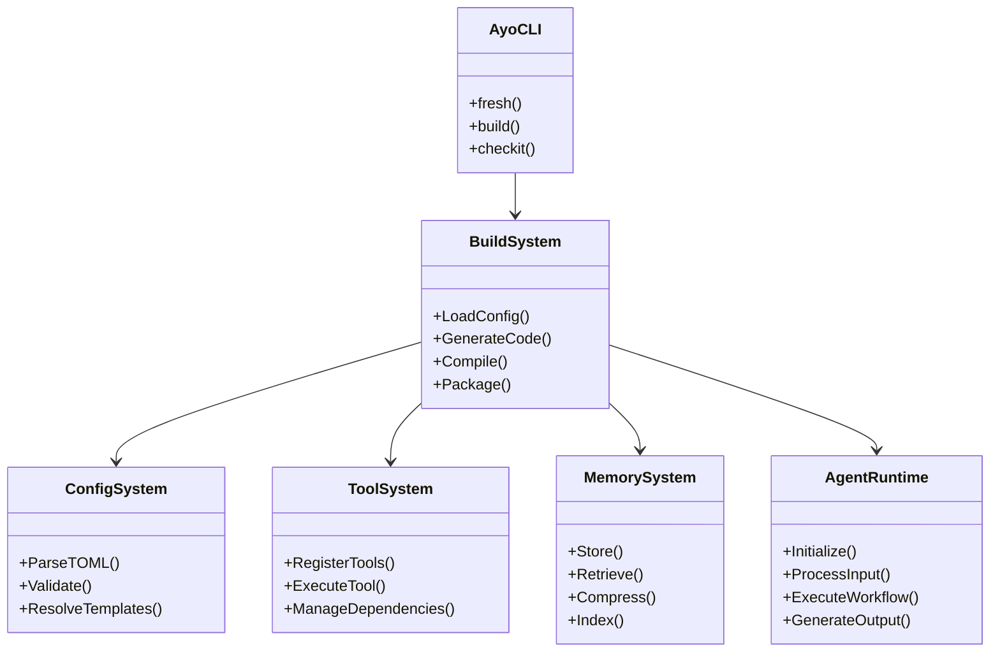
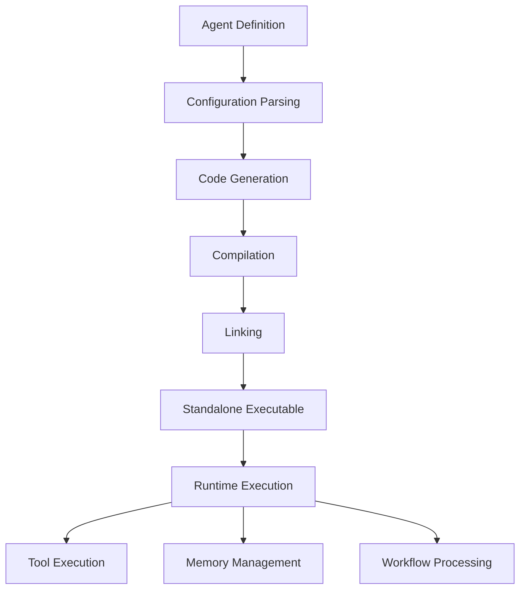
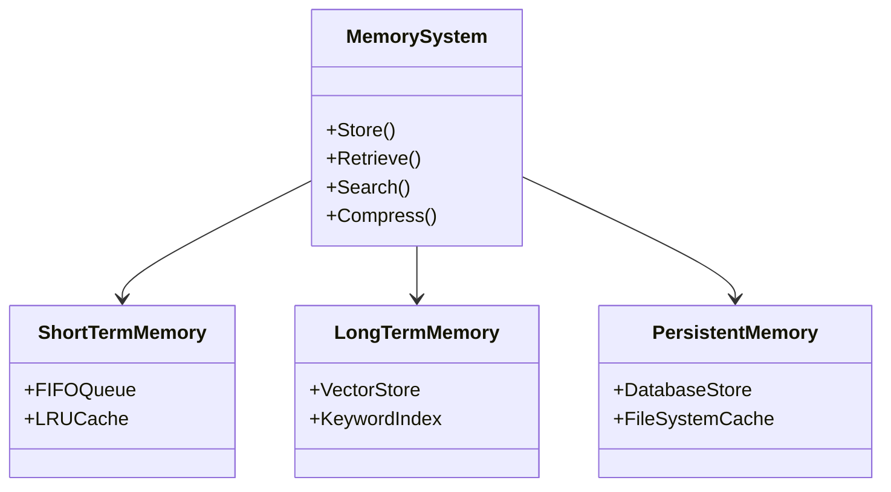

# Expert Reference Guide

## Deep Dive into Ayo Internals

This guide provides comprehensive reference material for Ayo experts who want to understand the system's internals, design patterns, and advanced optimization techniques.

## Table of Contents

1. [Architecture Overview](#architecture-overview)
2. [Build System Internals](#build-system-internals)
3. [Configuration System](#configuration-system)
4. [Tool System Design](#tool-system-design)
5. [Memory System Architecture](#memory-system-architecture)
6. [Performance Optimization](#performance-optimization)
7. [Design Patterns](#design-patterns)
8. [Advanced Debugging](#advanced-debugging)
9. [Contributing to Ayo](#contributing-to-ayo)

## Architecture Overview

### System Components



### Data Flow



## Build System Internals

### Build Process Phases

```go
// Build process in internal/build/build.go
func BuildAgent(configPath string) error {
    // Phase 1: Configuration Loading
    config, err := parser.LoadConfig(configPath)
    if err != nil { return err }
    
    // Phase 2: Validation
    if err := validator.ValidateConfig(config); err != nil { return err }
    
    // Phase 3: Code Generation
    if err := generator.GenerateMainStub(config); err != nil { return err }
    if err := generator.GenerateConfigEmbed(config); err != nil { return err }
    if err := generator.GenerateToolWrappers(config); err != nil { return err }
    
    // Phase 4: Compilation
    if err := compiler.CompileGoCode(config); err != nil { return err }
    
    // Phase 5: Packaging
    if err := packager.CreateExecutable(config); err != nil { return err }
    
    return nil
}
```

### Code Generation Details

```go
// GenerateMainStub creates the main.go file
func GenerateMainStub(config *types.Config, outputPath string) error {
    stub := fmt.Sprintf(`package main

import (
    _ "embed"
    "encoding/json"
    "fmt"
    "os"
)

//go:embed config.toml
var configToml []byte

func main() {
    // Initialize agent
    agent, err := NewAgent(string(configToml))
    if err != nil {
        fmt.Fprintf(os.Stderr, "Initialization error: %%v\\n", err)
        os.Exit(1)
    }
    
    // Process input
    input, err := ReadInput(os.Args[1:])
    if err != nil {
        fmt.Fprintf(os.Stderr, "Input error: %%v\\n", err)
        os.Exit(1)
    }
    
    // Execute workflow
    result, err := agent.Execute(input)
    if err != nil {
        fmt.Fprintf(os.Stderr, "Execution error: %%v\\n", err)
        os.Exit(1)
    }
    
    // Output result
    output, _ := json.Marshal(result)
    fmt.Println(string(output))
}
`, config.Agent.Name)
    
    return os.WriteFile(outputPath, []byte(stub), 0644)
}
```

### Compilation Process

```bash
# Compilation command template
go build \
    -o {{.OutputPath}} \
    -ldflags="\
        -s -w \
        -X main.Version={{.Version}} \
        -X main.BuildTime={{.BuildTime}} \
        -X main.Commit={{.Commit}}\
    " \
    {{.SourceFiles}}
```

## Configuration System

### Configuration Parsing

```go
// Config parsing in internal/build/parser.go
func ParseConfig(filePath string) (*types.Config, error) {
    // Read file
    content, err := os.ReadFile(filePath)
    if err != nil { return nil, err }
    
    // Parse TOML
    var config types.Config
    if err := toml.Unmarshal(content, &config); err != nil { return nil, err }
    
    // Resolve templates
    if err := resolveTemplates(&config); err != nil { return nil, err }
    
    // Set defaults
    setDefaults(&config)
    
    // Validate
    if err := validate(&config); err != nil { return nil, err }
    
    return &config, nil
}
```

### Template Resolution

```go
func resolveTemplates(config *types.Config) error {
    // Resolve string templates
    config.Agent.Name = resolveStringTemplate(config.Agent.Name, config)
    config.Agent.Description = resolveStringTemplate(config.Agent.Description, config)
    
    // Resolve tool configurations
    for i, tool := range config.Agent.Tools.Allowed {
        config.Agent.Tools.Allowed[i] = resolveStringTemplate(tool, config)
    }
    
    // Resolve prompt templates
    if config.Agent.Prompts != nil {
        for key, value := range config.Agent.Prompts {
            config.Agent.Prompts[key] = resolveStringTemplate(value, config)
        }
    }
    
    return nil
}
```

### Configuration Validation

```go
func validateConfig(config *types.Config) error {
    // Validate required fields
    if config.Agent.Name == "" {
        return fmt.Errorf("agent.name is required")
    }
    
    if config.Agent.Model == "" {
        return fmt.Errorf("agent.model is required")
    }
    
    // Validate schemas
    if config.Input.Schema != nil {
        if err := validateJSONSchema(config.Input.Schema); err != nil {
            return fmt.Errorf("invalid input schema: %w", err)
        }
    }
    
    // Validate tools
    for _, tool := range config.Agent.Tools.Allowed {
        if !isValidTool(tool) {
            return fmt.Errorf("invalid tool: %s", tool)
        }
    }
    
    return nil
}
```

## Tool System Design

### Tool Registration

```go
// Tool registry in internal/tools/registry.go
type ToolRegistry struct {
    tools map[string]Tool
    mu    sync.RWMutex
}

func (r *ToolRegistry) Register(name string, tool Tool) error {
    r.mu.Lock()
    defer r.mu.Unlock()
    
    if _, exists := r.tools[name]; exists {
        return fmt.Errorf("tool %s already registered", name)
    }
    
    r.tools[name] = tool
    return nil
}

func (r *ToolRegistry) Get(name string) (Tool, bool) {
    r.mu.RLock()
    defer r.mu.RUnlock()
    
    tool, exists := r.tools[name]
    return tool, exists
}
```

### Tool Execution

```go
// Tool execution in internal/tools/executor.go
func ExecuteTool(ctx context.Context, name string, args []string) ([]byte, error) {
    // Get tool from registry
    tool, exists := registry.Get(name)
    if !exists {
        return nil, fmt.Errorf("tool %s not found", name)
    }
    
    // Validate arguments
    if err := tool.ValidateArgs(args); err != nil {
        return nil, fmt.Errorf("invalid arguments: %w", err)
    }
    
    // Execute with timeout
    ctx, cancel := context.WithTimeout(ctx, tool.Timeout())
    defer cancel()
    
    result, err := tool.Execute(ctx, args)
    if err != nil {
        return nil, fmt.Errorf("execution failed: %w", err)
    }
    
    // Post-process result
    processed, err := tool.PostProcess(result)
    if err != nil {
        return nil, fmt.Errorf("post-processing failed: %w", err)
    }
    
    return processed, nil
}
```

### Built-in Tools Implementation

```go
// Bash tool implementation
func init() {
    registry.Register("bash", &BashTool{})
}

type BashTool struct{}

func (t *BashTool) Execute(ctx context.Context, args []string) ([]byte, error) {
    cmd := exec.CommandContext(ctx, "bash", "-c", args[0])
    
    // Set resource limits
    cmd.SysProcAttr = &syscall.SysProcAttr{
        Setpgid: true,
    }
    
    // Execute
    output, err := cmd.CombinedOutput()
    if err != nil {
        return nil, fmt.Errorf("bash execution failed: %w", err)
    }
    
    return output, nil
}

func (t *BashTool) Timeout() time.Duration {
    return 30 * time.Second
}

func (t *BashTool) ValidateArgs(args []string) error {
    if len(args) != 1 {
        return fmt.Errorf("bash requires exactly 1 argument")
    }
    if len(args[0]) > 10000 {
        return fmt.Errorf("command too long (max 10000 chars)")
    }
    return nil
}
```

## Memory System Architecture

### Memory Storage Layers



### Memory Storage Implementation

```go
// Memory storage in internal/memory/storage.go
type MemoryStorage struct {
    shortTerm  *ShortTermStore
    longTerm   *LongTermStore
    persistent *PersistentStore
    config     *types.MemoryConfig
}

func NewMemoryStorage(config *types.MemoryConfig) *MemoryStorage {
    return &MemoryStorage{
        shortTerm:  NewShortTermStore(config),
        longTerm:   NewLongTermStore(config),
        persistent: NewPersistentStore(config),
        config:     config,
    }
}

func (m *MemoryStorage) Store(ctx context.Context, item MemoryItem) error {
    // Store in short-term
    if err := m.shortTerm.Store(item); err != nil {
        return err
    }
    
    // Store in long-term if enabled
    if m.config.Scope == "session" || m.config.Scope == "persistent" {
        if err := m.longTerm.Store(item); err != nil {
            return err
        }
    }
    
    // Store in persistent if enabled
    if m.config.Scope == "persistent" {
        if err := m.persistent.Store(item); err != nil {
            return err
        }
    }
    
    return nil
}
```

### Memory Retrieval Strategies

```go
func (m *MemoryStorage) Retrieve(ctx context.Context, query string, limit int) ([]MemoryItem, error) {
    var results []MemoryItem
    
    // Strategy based on configuration
    switch m.config.RetrievalStrategy {
    case "hybrid":
        items, err := m.hybridRetrieval(ctx, query, limit)
        if err != nil {
            return nil, err
        }
        results = append(results, items...)
        
    case "semantic":
        items, err := m.semanticRetrieval(ctx, query, limit)
        if err != nil {
            return nil, err
        }
        results = append(results, items...)
        
    default: // keyword
        items, err := m.keywordRetrieval(ctx, query, limit)
        if err != nil {
            return nil, err
        }
        results = append(results, items...)
    }
    
    // Apply post-retrieval processing
    return m.postRetrievalProcessing(results), nil
}
```

## Performance Optimization

### Caching Strategies

```go
// Cache implementation in internal/cache/cache.go
type Cache struct {
    store     map[string]CacheItem
    mu        sync.RWMutex
    ttl       time.Duration
    maxSize   int
    eviction  EvictionPolicy
    metrics   *CacheMetrics
}

func (c *Cache) Get(key string) ([]byte, bool) {
    c.mu.RLock()
    defer c.mu.RUnlock()
    
    item, exists := c.store[key]
    if !exists {
        c.metrics.Miss()
        return nil, false
    }
    
    if item.Expired() {
        c.metrics.Expire()
        return nil, false
    }
    
    c.metrics.Hit()
    item.Accessed = time.Now()
    c.store[key] = item
    
    return item.Data, true
}

func (c *Cache) Set(key string, data []byte) {
    c.mu.Lock()
    defer c.mu.Unlock()
    
    // Evict if needed
    if len(c.store) >= c.maxSize {
        c.evict()
    }
    
    // Store new item
    c.store[key] = CacheItem{
        Data:     data,
        Created:  time.Now(),
        Accessed: time.Now(),
        TTL:      c.ttl,
    }
    
    c.metrics.Set()
}
```

### Parallel Execution

```go
// Parallel executor in internal/executor/parallel.go
type ParallelExecutor struct {
    workerPool chan struct{}
    wg         sync.WaitGroup
    errors     chan error
    results    chan ExecutionResult
}

func NewParallelExecutor(maxWorkers int) *ParallelExecutor {
    return &ParallelExecutor{
        workerPool: make(chan struct{}, maxWorkers),
        errors:     make(chan error, maxWorkers),
        results:    make(chan ExecutionResult, maxWorkers),
    }
}

func (e *ParallelExecutor) Execute(tasks []Task) ([]ExecutionResult, error) {
    // Start workers
    for _, task := range tasks {
        e.workerPool <- struct{}{}
        
        e.wg.Add(1)
        go func(t Task) {
            defer e.wg.Done()
            defer func() { <-e.workerPool }()
            
            result, err := t.Execute()
            if err != nil {
                e.errors <- err
                return
            }
            
            e.results <- result
        }(task)
    }
    
    // Wait for completion
    e.wg.Wait()
    close(e.errors)
    close(e.results)
    
    // Collect results
    var results []ExecutionResult
    for result := range e.results {
        results = append(results, result)
    }
    
    // Check for errors
    var errors []error
    for err := range e.errors {
        errors = append(errors, err)
    }
    
    if len(errors) > 0 {
        return nil, fmt.Errorf("%d tasks failed: %v", len(errors), errors)
    }
    
    return results, nil
}
```

### Resource Management

```go
// Resource manager in internal/resources/manager.go
type ResourceManager struct {
    cpuLimit    float64
    memoryLimit int64
    concurrency int
    semaphore   chan struct{}
    metrics     *ResourceMetrics
}

func NewResourceManager(config *types.ResourceConfig) *ResourceManager {
    return &ResourceManager{
        cpuLimit:    config.CPULimit,
        memoryLimit: config.MemoryLimit,
        concurrency: config.ConcurrencyLimit,
        semaphore:   make(chan struct{}, config.ConcurrencyLimit),
        metrics:     NewResourceMetrics(),
    }
}

func (r *ResourceManager) Acquire() (ResourceToken, error) {
    select {
    case r.semaphore <- struct{}{}:
        r.metrics.Acquire()
        return &resourceToken{manager: r}, nil
    default:
        r.metrics.Reject()
        return nil, fmt.Errorf("resource limit reached")
    }
}

func (r *ResourceManager) Monitor() {
    ticker := time.NewTicker(5 * time.Second)
    defer ticker.Stop()
    
    for range ticker.C {
        cpuUsage := getCPUUsage()
        memoryUsage := getMemoryUsage()
        
        if cpuUsage > r.cpuLimit {
            r.metrics.CPUOverload()
            // Scale up or throttle
        }
        
        if memoryUsage > r.memoryLimit {
            r.metrics.MemoryOverload()
            // Trigger GC or scale up
        }
    }
}
```

## Design Patterns

### Agent Patterns

```go
// Agent pattern implementations

// 1. Chain of Responsibility
type Handler interface {
    SetNext(Handler)
    Handle(request Request) Response
}

type BaseHandler struct {
    next Handler
}

func (h *BaseHandler) SetNext(next Handler) {
    h.next = next
}

func (h *BaseHandler) Handle(request Request) Response {
    if h.next != nil {
        return h.next.Handle(request)
    }
    return Response{}
}

// 2. Strategy Pattern
type ExecutionStrategy interface {
    Execute(request Request) (Response, error)
}

type FastStrategy struct{}

func (s *FastStrategy) Execute(request Request) (Response, error) {
    // Fast execution logic
}

type AccurateStrategy struct{}

func (s *AccurateStrategy) Execute(request Request) (Response, error) {
    // Accurate execution logic
}

// 3. Observer Pattern
type EventObserver interface {
    OnEvent(event Event)
}

type EventManager struct {
    observers []EventObserver
}

func (m *EventManager) Register(observer EventObserver) {
    m.observers = append(m.observers, observer)
}

func (m *EventManager) Notify(event Event) {
    for _, observer := range m.observers {
        observer.OnEvent(event)
    }
}
```

### Configuration Patterns

```go
// Configuration patterns

// 1. Builder Pattern
type AgentBuilder struct {
    agent *Agent
}

func NewAgentBuilder() *AgentBuilder {
    return &AgentBuilder{agent: &Agent{}}
}

func (b *AgentBuilder) WithName(name string) *AgentBuilder {
    b.agent.Name = name
    return b
}

func (b *AgentBuilder) WithModel(model string) *AgentBuilder {
    b.agent.Model = model
    return b
}

func (b *AgentBuilder) Build() *Agent {
    // Validate and return
    return b.agent
}

// 2. Factory Pattern
type AgentFactory struct {
    configs map[string]*types.Config
}

func (f *AgentFactory) CreateAgent(name string) (*Agent, error) {
    config, exists := f.configs[name]
    if !exists {
        return nil, fmt.Errorf("config not found")
    }
    
    return NewAgentFromConfig(config)
}

// 3. Prototype Pattern
type AgentPrototype struct {
    prototype *Agent
}

func (p *AgentPrototype) Clone() *Agent {
    // Deep copy logic
    return &Agent{
        Name: p.prototype.Name + "_clone",
        Model: p.prototype.Model,
        // Copy other fields
    }
}
```

### Error Handling Patterns

```go
// Error handling patterns

// 1. Circuit Breaker
type CircuitBreaker struct {
    state        string
    failureCount int
    lastFailure  time.Time
    threshold    int
    timeout      time.Duration
}

func (cb *CircuitBreaker) Execute(fn func() error) error {
    if cb.state == "open" {
        if time.Since(cb.lastFailure) > cb.timeout {
            cb.state = "half-open"
        } else {
            return fmt.Errorf("circuit breaker is open")
        }
    }
    
    err := fn()
    if err != nil {
        cb.failureCount++
        cb.lastFailure = time.Now()
        
        if cb.failureCount >= cb.threshold {
            cb.state = "open"
        }
        
        return err
    }
    
    // Reset on success
    if cb.state == "half-open" {
        cb.state = "closed"
        cb.failureCount = 0
    }
    
    return nil
}

// 2. Retry Pattern
type RetryPolicy struct {
    maxAttempts int
    backoff     BackoffStrategy
}

func (r *RetryPolicy) Execute(fn func() error) error {
    var lastError error
    
    for attempt := 1; attempt <= r.maxAttempts; attempt++ {
        err := fn()
        if err == nil {
            return nil
        }
        
        lastError = err
        
        if attempt < r.maxAttempts {
            delay := r.backoff.CalculateDelay(attempt)
            time.Sleep(delay)
        }
    }
    
    return fmt.Errorf("after %d attempts: %w", r.maxAttempts, lastError)
}

// 3. Fallback Pattern
type FallbackExecutor struct {
    primary   func() (Result, error)
    fallback func() (Result, error)
}

func (e *FallbackExecutor) Execute() (Result, error) {
    result, err := e.primary()
    if err == nil {
        return result, nil
    }
    
    // Log primary failure
    log.Printf("Primary failed: %v, using fallback", err)
    
    return e.fallback()
}
```

## Advanced Debugging

### Debugging Tools

```bash
# Advanced debugging commands

# 1. Profile CPU usage
ao profile my-agent --cpu --duration 30

# 2. Profile memory usage
ao profile my-agent --memory --duration 60

# 3. Trace execution
ao trace my-agent --input '{"query": "test"}' --output trace.json

# 4. Debug tool execution
ao debug my-agent --tool bash --args '"ls -la"'

# 5. Analyze dependencies
ao analyze my-agent --dependencies --visualize
```

### Debugging Configuration

```toml
[agent.debug]
enabled = true
level = "trace"  # debug, trace, or profile

[agent.debug.output]
file = "./debug.log"
console = true
max_size = 100  # MB

[agent.debug.profiling]
cpu = true
memory = true
block = true
goroutine = true

[agent.debug.tracing]
enabled = true
sampling_rate = 1.0  # 100% sampling
max_spans = 10000
```

### Debugging Techniques

```go
// Debugging utilities

// 1. Execution Tracer
type ExecutionTracer struct {
    events []TraceEvent
    mu     sync.Mutex
}

func (t *ExecutionTracer) Trace(event TraceEvent) {
    t.mu.Lock()
    defer t.mu.Unlock()
    t.events = append(t.events, event)
}

func (t *ExecutionTracer) Export() []TraceEvent {
    t.mu.Lock()
    defer t.mu.Unlock()
    return append([]TraceEvent(nil), t.events...)
}

// 2. Performance Monitor
type PerformanceMonitor struct {
    startTime time.Time
    metrics   map[string]time.Duration
}

func (m *PerformanceMonitor) Start() {
    m.startTime = time.Now()
}

func (m *PerformanceMonitor) Measure(key string) {
    m.metrics[key] = time.Since(m.startTime)
}

func (m *PerformanceMonitor) Report() map[string]time.Duration {
    return m.metrics
}

// 3. Memory Analyzer
type MemoryAnalyzer struct {
    baseline runtime.MemStats
}

func (a *MemoryAnalyzer) Start() {
    runtime.ReadMemStats(&a.baseline)
}

func (a *MemoryAnalyzer) Analyze() MemoryReport {
    var current runtime.MemStats
    runtime.ReadMemStats(&current)
    
    return MemoryReport{
        Alloc:      current.Alloc - a.baseline.Alloc,
        TotalAlloc: current.TotalAlloc - a.baseline.TotalAlloc,
        Sys:        current.Sys - a.baseline.Sys,
        Mallocs:    current.Mallocs - a.baseline.Mallocs,
        Frees:      current.Frees - a.baseline.Frees,
    }
}
```

## Contributing to Ayo

### Development Setup

```bash
# Clone repository
git clone https://github.com/alexcabrera/ayo.git
cd ayo

# Install dependencies
go mod download
make deps

# Build
go build ./cmd/ayo

# Test
make test

# Run
./ayo --version
```

### Code Structure

```
ao/
├── cmd/              # CLI commands
│   └── ayo/          # Main CLI
├── internal/         # Core packages
│   ├── build/        # Build system
│   ├── config/       # Configuration
│   ├── tools/        # Tool system
│   ├── memory/       # Memory system
│   ├── agent/        # Agent runtime
│   └── ...
├── docs/             # Documentation
├── test/             # Tests
└── scripts/          # Build scripts
```

### Contribution Guidelines

```markdown
1. **Fork the repository**
2. **Create a feature branch**: `git checkout -b feature/my-feature`
3. **Commit changes**: `git commit -am 'Add some feature'`
4. **Push to branch**: `git push origin feature/my-feature`
5. **Submit a pull request**

**Code Standards:**
- Follow Go conventions
- Write tests for new features
- Document public APIs
- Keep changes focused

**Testing:**
- Run `make test` before submitting
- Ensure all tests pass
- Add tests for new functionality

**Documentation:**
- Update docs for new features
- Add examples where helpful
- Keep API docs current
```

### Building from Source

```bash
# Full build process
make clean
make deps
make build
make test
make install

# Cross-compilation
make build-linux
make build-windows
make build-macos

# Docker build
make docker-build
make docker-push
```

## Summary

✅ **Understood Ayo architecture**
✅ **Mastered build system internals**
✅ **Explored configuration system**
✅ **Deep dive into tool system**
✅ **Comprehensive memory system knowledge**
✅ **Advanced performance optimization**
✅ **Design patterns for agent systems**
✅ **Expert debugging techniques**
✅ **Contribution guidelines**

You now have expert-level knowledge of Ayo! 🎉

**Next**: [Troubleshooting & Best Practices](06-troubleshooting.md) → Comprehensive guide to solving common issues and optimization techniques