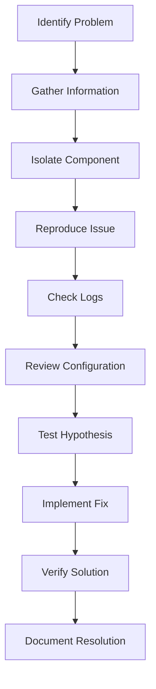
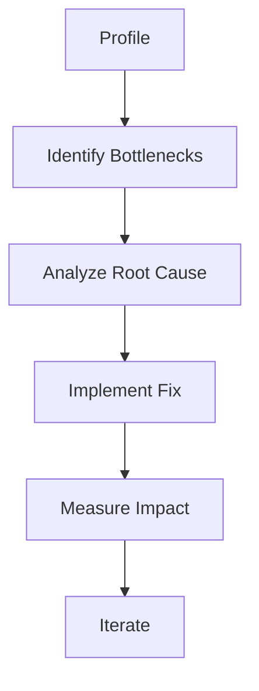
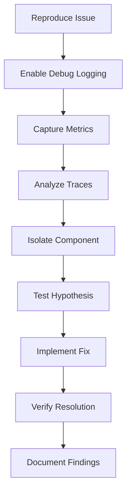

# Troubleshooting & Best Practices

## Comprehensive Guide to Solving Issues and Optimization

This guide provides systematic approaches to troubleshooting common issues and implementing best practices for optimal Ayo usage.

## Table of Contents

1. [Systematic Troubleshooting Approach](#systematic-troubleshooting-approach)
2. [Common Issues and Solutions](#common-issues-and-solutions)
3. [Performance Optimization](#performance-optimization)
4. [Security Best Practices](#security-best-practices)
5. [Deployment Best Practices](#deployment-best-practices)
6. [Monitoring and Maintenance](#monitoring-and-maintenance)
7. [Advanced Debugging Techniques](#advanced-debugging-techniques)
8. [Optimization Checklists](#optimization-checklists)

## Systematic Troubleshooting Approach

### Troubleshooting Framework



### Problem Identification Matrix

| Symptom | Likely Cause | Diagnostic Command |
|---------|-------------|-------------------|
| Build fails | Configuration error | `ayo checkit --verbose` |
| Agent crashes | Runtime error | `./agent --debug` |
| Slow performance | Resource constraints | `ayo profile --cpu` |
| Memory leaks | Memory management | `ayo monitor --memory` |
| Tool failures | Tool configuration | `ayo test --tool toolname` |
| Network issues | Connectivity | `ayo diagnose --network` |

## Common Issues and Solutions

### Build Issues

**Issue: Build fails with syntax error**

```bash
# Error: "Invalid TOML syntax"

# Solution:
ayo checkit my-agent --config-only

# Check specific line
ayo checkit my-agent --line 42

# Fix syntax and rebuild
ao build my-agent
```

**Issue: Missing dependencies**

```bash
# Error: "package not found"

# Solution:
go mod tidy
ayo build my-agent

# If using custom tools
ayo checkit my-agent --tools
```

**Issue: Schema validation fails**

```bash
# Error: "Invalid JSON schema"

# Solution:
ayo checkit my-agent --schema-only

# Use external validator
ajv validate -s config.toml

# Fix schema issues
```

### Runtime Issues

**Issue: Agent crashes on startup**

```bash
# Error: "panic: runtime error"

# Solution:
./my-agent/main --debug "test"

# Check configuration
ao checkit my-agent

# Test with minimal config
ao build my-agent --minimal
```

**Issue: Tool execution hangs**

```bash
# Error: "tool execution timeout"

# Solution:
# Increase timeout in config.toml
[agent.tools]
timeout = 60  # Increase from 30

# Test tool individually
ayo test my-agent --tool bash --args '"ls -la"'

# Check tool permissions
chmod +x my-agent/tools/*
```

**Issue: Memory overflow**

```bash
# Error: "out of memory"

# Solution:
# Monitor memory usage
ao monitor my-agent --memory

# Limit memory in config.toml
[agent.resources]
memory_limit = "1Gi"

# Enable memory compression
[agent.memory.compression]
enabled = true
```

### Configuration Issues

**Issue: Invalid configuration values**

```bash
# Error: "invalid configuration"

# Solution:
ayo checkit my-agent --validate

# Check specific sections
ayo checkit my-agent --section agent
ayo checkit my-agent --section tools

# Use default values
ao build my-agent --defaults
```

**Issue: Template resolution fails**

```bash
# Error: "template rendering failed"

# Solution:
ayo checkit my-agent --templates

# Test template rendering
ao render my-agent --template "{{.Agent.Name}}"

# Fix template syntax
```

### Network Issues

**Issue: Multi-agent communication fails**

```bash
# Error: "connection refused"

# Solution:
ayo diagnose team-coordinator --network

# Check ports
netstat -tuln | grep 8080

# Test connectivity
curl http://team-coordinator:8080/health
```

**Issue: API rate limiting**

```bash
# Error: "rate limit exceeded"

# Solution:
# Configure retry policy
[agent.error_handling]
max_retries = 5
retry_delay = 10
backoff_factor = 2.0

# Implement circuit breaker
[agent.circuit_breakers]
api_calls = {
  failure_threshold = 3,
  recovery_timeout = 60
}
```

## Performance Optimization

### Optimization Framework



### Performance Checklist

```markdown
✅ **CPU Optimization**
- [ ] Profile CPU usage: `ayo profile --cpu`
- [ ] Optimize temperature settings
- [ ] Limit concurrent operations
- [ ] Use efficient algorithms

✅ **Memory Optimization**
- [ ] Profile memory usage: `ayo profile --memory`
- [ ] Enable memory compression
- [ ] Set appropriate memory limits
- [ ] Use streaming for large data

✅ **I/O Optimization**
- [ ] Minimize file operations
- [ ] Use buffering for I/O
- [ ] Batch small operations
- [ ] Cache frequent requests

✅ **Network Optimization**
- [ ] Reduce API calls
- [ ] Implement caching
- [ ] Use connection pooling
- [ ] Compress data in transit
```

### CPU Optimization

```toml
[agent.performance]
# Optimize model settings
temperature = 0.3  # Lower for deterministic tasks
max_tokens = 2048  # Reduce from 4096

# Enable caching
cache = {
  enabled = true,
  size = 100,
  ttl = 300
}

# Limit concurrency
parallel_execution = {
  enabled = true,
  max_concurrent = 4
}
```

### Memory Optimization

```toml
[agent.memory]
# Choose appropriate scope
scope = "conversation"  # For short interactions

# Enable compression
compression = {
  enabled = true,
  method = "semantic",
  ratio = 0.7
}

# Limit history
max_history = 100

# Use efficient storage
storage = "vector"
```

### I/O Optimization

```toml
[agent.io]
# Enable buffering
buffer_size = 8192
flush_interval = 100  # milliseconds

# Batch operations
batch_size = 100
batch_timeout = 500  # milliseconds

# Use efficient formats
preferred_format = "binary"  # binary, json, or text
compression = "gzip"
```

## Security Best Practices

### Security Checklist

```markdown
✅ **Authentication**
- [ ] Enable JWT or API key authentication
- [ ] Use strong secrets
- [ ] Rotate credentials regularly
- [ ] Implement proper token expiration

✅ **Authorization**
- [ ] Use RBAC for access control
- [ ] Follow principle of least privilege
- [ ] Regularly audit permissions
- [ ] Implement proper role hierarchy

✅ **Data Protection**
- [ ] Enable data encryption
- [ ] Implement proper redaction
- [ ] Use secure storage for secrets
- [ ] Comply with regulations

✅ **Network Security**
- [ ] Use TLS for all communications
- [ ] Implement proper firewalls
- [ ] Regular security audits
- [ ] Keep dependencies updated
```

### Authentication Configuration

```toml
[agent.security.authentication]
type = "jwt"
secret = "${JWT_SECRET}"  # Use environment variable
expiration = 3600  # 1 hour
issuer = "ayo-agent"
algorithms = ["HS256"]

# API key alternative
# type = "api_key"
# header = "X-API-Key"
# prefix = "ak_"
```

### Authorization Configuration

```toml
[agent.security.authorization]
type = "rbac"

roles = ["admin", "user", "guest"]

policies = {
  admin = ["*"],
  user = ["read", "execute", "write"],
  guest = ["read"]
}

# Resource-specific permissions
resources = {
  "/admin" = ["admin"],
  "/api" = ["admin", "user"],
  "/public" = ["admin", "user", "guest"]
}
```

### Data Protection Configuration

```toml
[agent.security.data]
# Redaction patterns
redaction = {
  enabled = true,
  patterns = [
    "\\b\\w*password\\w*\\b",
    "\\b\\w*secret\\w*\\b",
    "\\b\\w*token\\w*\\b",
    "\\b\\w*key\\w*\\b"
  ],
  replacement = "[REDACTED]"
}

# Field-level encryption
encryption = {
  fields = ["password", "credit_card", "ssn"],
  algorithm = "aes-256-cbc",
  key_rotation = 30  # days
}

# Data masking
masking = {
  enabled = true,
  patterns = [
    { type = "email", mask = "**@**.com" },
    { type = "credit_card", mask = "****-****-****-1234" },
    { type = "phone", mask = "***-***-1234" }
  ]
}
```

## Deployment Best Practices

### Deployment Checklist

```markdown
✅ **Pre-Deployment**
- [ ] Test in staging environment
- [ ] Verify all dependencies
- [ ] Check resource requirements
- [ ] Backup existing deployment

✅ **Deployment**
- [ ] Use phased rollout
- [ ] Monitor during deployment
- [ ] Have rollback plan ready
- [ ] Verify health checks

✅ **Post-Deployment**
- [ ] Monitor performance
- [ ] Check error rates
- [ ] Verify functionality
- [ ] Update documentation
```

### Container Deployment

```yaml
# Best practice Dockerfile
FROM alpine:latest

# Security best practices
USER nobody:nobody
WORKDIR /app

# Install only necessary dependencies
RUN apk add --no-cache bash curl jq python3

# Copy files
COPY --chown=nobody:nobody . /app

# Set permissions
RUN chmod 555 /app/main
RUN find /app/tools -type f -exec chmod 555 {} \;

# Health checks
HEALTHCHECK --interval=30s --timeout=3s \
  CMD ["/app/main", "--health-check"] || exit 1

# Run as non-root
USER nobody:nobody
CMD ["/app/main"]
```

### Kubernetes Deployment

```yaml
# Best practice Kubernetes deployment
apiVersion: apps/v1
kind: Deployment
metadata:
  name: ayo-agent
spec:
  replicas: 3
  strategy:
    rollingUpdate:
      maxSurge: 1
      maxUnavailable: 0
    type: RollingUpdate
  template:
    spec:
      securityContext:
        runAsNonRoot: true
        runAsUser: 1000
        fsGroup: 2000
      containers:
      - name: ayo-agent
        image: my-ayo-agent:latest
        ports:
        - containerPort: 8080
        resources:
          requests:
            cpu: "500m"
            memory: "512Mi"
          limits:
            cpu: "1000m"
            memory: "1Gi"
        livenessProbe:
          httpGet:
            path: /health
            port: 8080
          initialDelaySeconds: 30
          periodSeconds: 10
          failureThreshold: 3
        readinessProbe:
          httpGet:
            path: /ready
            port: 8080
          initialDelaySeconds: 5
          periodSeconds: 5
          failureThreshold: 3
        securityContext:
          allowPrivilegeEscalation: false
          readOnlyRootFilesystem: true
          capabilities:
            drop: ["ALL"]
```

## Monitoring and Maintenance

### Monitoring Configuration

```toml
[agent.monitoring]
# Metrics
metrics = {
  enabled = true,
  port = 9090,
  path = "/metrics"
}

# Logging
logging = {
  level = "info",
  format = "json",
  output = ["stdout", "file"]
}

# Tracing
tracing = {
  enabled = true,
  provider = "jaeger",
  sampling_rate = 0.1
}

# Health checks
health = {
  enabled = true,
  path = "/health",
  interval = 30
}
```

### Maintenance Checklist

```markdown
✅ **Daily**
- [ ] Check error logs
- [ ] Monitor resource usage
- [ ] Verify health checks
- [ ] Review performance metrics

✅ **Weekly**
- [ ] Review security logs
- [ ] Check for updates
- [ ] Test backup restoration
- [ ] Review access logs

✅ **Monthly**
- [ ] Rotate credentials
- [ ] Review permissions
- [ ] Test disaster recovery
- [ ] Update documentation

✅ **Quarterly**
- [ ] Security audit
- [ ] Performance review
- [ ] Dependency updates
- [ ] Capacity planning
```

## Advanced Debugging Techniques

### Debugging Toolkit

```bash
# Comprehensive debugging commands

# 1. Full system profile
ao profile my-agent --all --duration 60

# 2. Memory leak detection
ao debug my-agent --memory --leak-detection

# 3. Race condition detection
ao debug my-agent --race --iterations 100

# 4. Deadlock detection
ao debug my-agent --deadlock --timeout 30

# 5. Network tracing
ao debug my-agent --network --capture traffic.pcap
```

### Debugging Configuration

```toml
[agent.debug]
# Enable comprehensive debugging
level = "trace"

# Output configuration
output = {
  file = "./debug.log",
  console = true,
  max_size = 100
}

# Profiling
profiling = {
  cpu = true,
  memory = true,
  block = true,
  goroutine = true,
  mutex = true
}

# Tracing
tracing = {
  enabled = true,
  sampling_rate = 1.0,
  max_spans = 10000
}

# Debug hooks
hooks = ["startup", "shutdown", "error", "panic"]
```

### Debugging Workflow



## Optimization Checklists

### Beginner Optimization Checklist

```markdown
✅ **Configuration**
- [ ] Use appropriate model for task
- [ ] Set reasonable temperature
- [ ] Limit max_tokens appropriately
- [ ] Validate schemas

✅ **Tools**
- [ ] Only enable necessary tools
- [ ] Set reasonable timeouts
- [ ] Configure retry policies
- [ ] Test tools individually

✅ **Memory**
- [ ] Choose appropriate scope
- [ ] Set reasonable history limits
- [ ] Enable compression if needed
- [ ] Monitor memory usage

✅ **Performance**
- [ ] Profile before optimizing
- [ ] Cache frequent requests
- [ ] Limit concurrency
- [ ] Monitor resource usage
```

### Intermediate Optimization Checklist

```markdown
✅ **Advanced Configuration**
- [ ] Optimize prompt engineering
- [ ] Implement skill chaining
- [ ] Configure tool workflows
- [ ] Set up conditional execution

✅ **Error Handling**
- [ ] Configure retry policies
- [ ] Implement circuit breakers
- [ ] Set up fallback mechanisms
- [ ] Configure proper logging

✅ **Testing**
- [ ] Implement unit tests
- [ ] Set up integration tests
- [ ] Configure performance tests
- [ ] Monitor test coverage

✅ **Deployment**
- [ ] Use proper deployment strategy
- [ ] Configure health checks
- [ ] Set up monitoring
- [ ] Implement proper logging
```

### Advanced Optimization Checklist

```markdown
✅ **Production Readiness**
- [ ] Implement multi-agent orchestration
- [ ] Configure complex workflows
- [ ] Set up proper authentication
- [ ] Implement authorization

✅ **Security**
- [ ] Enable data encryption
- [ ] Configure proper redaction
- [ ] Set up audit logging
- [ ] Implement compliance measures

✅ **Scaling**
- [ ] Configure horizontal scaling
- [ ] Set up vertical scaling
- [ ] Implement load balancing
- [ ] Configure resource limits

✅ **Observability**
- [ ] Set up comprehensive metrics
- [ ] Configure structured logging
- [ ] Implement distributed tracing
- [ ] Set up alerting
```

## Summary

✅ **Systematic troubleshooting approach**
✅ **Common issues and solutions**
✅ **Performance optimization techniques**
✅ **Security best practices**
✅ **Deployment best practices**
✅ **Monitoring and maintenance**
✅ **Advanced debugging techniques**
✅ **Comprehensive optimization checklists**

You now have a complete troubleshooting and optimization toolkit! 🎉

**Next**: Update README.md with documentation structure and commit changes