# Ayo Operator Manual

## 🎓 Comprehensive Learning Path

This operator manual provides a structured learning path from novice to expert, with comprehensive documentation covering all aspects of Ayo agent development.

## 📚 Documentation Structure

```
docs/operator-manual/
├── README.md                    # This file
├── 01-getting-started.md        # 🟢 Novice Level
├── 02-basic-usage.md           # 🟡 Beginner Level
├── 03-intermediate-techniques.md # 🟠 Intermediate Level
├── 04-advanced-patterns.md     # 🔴 Advanced Level
├── 05-expert-reference.md      # 🟣 Expert Level
└── 06-troubleshooting.md      # 🛠 All Levels
```

## 🎯 Learning Path

### 1. Getting Started (Novice)
**For**: Complete beginners
**Covers**: Installation, first agent, basic concepts
**Time**: 30-60 minutes

[→ Start Here](01-getting-started.md)

### 2. Basic Usage (Beginner)
**For**: Users comfortable with basics
**Covers**: Configuration, tools, I/O patterns, debugging
**Time**: 2-4 hours

[→ Basic Usage](02-basic-usage.md)

### 3. Intermediate Techniques
**For**: Experienced users
**Covers**: Prompt engineering, skills, memory optimization
**Time**: 4-8 hours

[→ Intermediate](03-intermediate-techniques.md)

### 4. Advanced Patterns
**For**: Production users
**Covers**: Multi-agent systems, deployment, scaling
**Time**: 8-16 hours

[→ Advanced](04-advanced-patterns.md)

### 5. Expert Reference
**For**: Power users and contributors
**Covers**: Internals, design patterns, contributing
**Time**: 16+ hours

[→ Expert](05-expert-reference.md)

### 6. Troubleshooting & Best Practices
**For**: All levels
**Covers**: Common issues, optimization, best practices
**Time**: Reference as needed

[→ Troubleshooting](06-troubleshooting.md)

## 🍳 Additional Resources

### Cookbook
Practical examples and recipes:
- [Cookbook](../../COOKBOOK.md) - File processing, web automation, data analysis
- [Patterns](../../patterns/) - Ticket workers, scheduled agents, watchers

### Reference
- [Operator Manual](../../OPERATOR_MANUAL.md) - Comprehensive usage guide
- [Build System](../../BUILD_SYSTEM.md) - Technical overview
- [Concepts](../../concepts.md) - Core concepts and architecture

## 📈 Skill Progression

```mermaid
gantt
    title Ayo Skill Development Path
    dateFormat  X
    axisFormat %s
    
    section Novice
    Getting Started    :a1, 0, 1d
    
    section Beginner
    Basic Usage        :a2, after a1, 2d
    
    section Intermediate
    Techniques         :a3, after a2, 3d
    
    section Advanced
    Patterns           :a4, after a3, 4d
    
    section Expert
    Reference          :a5, after a4, 5d
    
    section All Levels
    Troubleshooting     :a6, 0, 6d
```



## 🎯 Quick Reference

### Common Commands

```bash
# Create agent
ao fresh my-agent

# Build agent
ao build my-agent

# Validate configuration
ao checkit my-agent

# Run agent
./my-agent/main "Hello"
```

### Configuration Structure

```toml
[agent]
name = "my-agent"
description = "My AI agent"
model = "gpt-4o"

[cli]
mode = "interactive"

[input]
schema = { type = "object", properties = { query = { type = "string" } } }

[agent.tools]
allowed = ["bash", "file_read"]

[agent.memory]
enabled = true
scope = "conversation"
```

## 🤝 Community & Support

- **Issues**: Report bugs and request features
- **Discussions**: Ask questions and share ideas
- **Contributing**: Help improve Ayo
- **Documentation**: Suggest improvements

## 📋 Checklists

### Getting Started Checklist
- [ ] Install Ayo
- [ ] Create first agent
- [ ] Build and run agent
- [ ] Modify configuration
- [ ] Add a custom tool

### Production Readiness Checklist
- [ ] Configure proper error handling
- [ ] Set up monitoring
- [ ] Implement logging
- [ ] Configure security
- [ ] Test deployment

## 🎓 Learning Resources

- **Official Documentation**: Complete reference
- **Cookbook**: Practical examples
- **Patterns**: Common use cases
- **API Reference**: Technical details

## 🚀 Next Steps

1. **Start with Getting Started** if you're new
2. **Explore Basic Usage** to understand core concepts
3. **Dive into Intermediate Techniques** for advanced features
4. **Master Advanced Patterns** for production use
5. **Contribute** to help improve Ayo

Happy agent building! 🤖